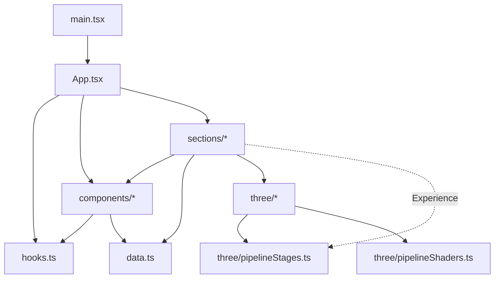

# Architecture — Do Tan Tuong Portfolio

Trang portfolio một trang (single page), không backend. Cập nhật theo code sau refactor ngày 2026-09-15.

## Stack

| Lớp | Công nghệ |
|---|---|
| UI | React 19, TypeScript ~6.0 |
| Build / dev | Vite 8 (`npm run dev`, `npm run build` = `tsc -b && vite build`) |
| 3D | three.js 0.186, WebGL thuần, không wrapper |
| Icon thương hiệu | `simple-icons` |
| Lint | oxlint (`react`, `typescript`, `oxc`) |
| QA | script Playwright trong `qa/*.mjs` (chạy tay, không phải test tự động) |
| Deploy | Vercel, output `dist/` |

## Cấu trúc thư mục

```
src/
  main.tsx            điểm vào: mount <App/>, import styles.css
  App.tsx             khung trang: skip link, GlowCursor, Nav, 7 section, Footer, ToTop
  data.ts             toàn bộ nội dung cá nhân (PROFILE, NAV, EXPERIENCE, PROJECTS, …)
  hooks.ts            useReducedMotion, useReveal, useActiveSection, useTypewriter, useScrollEngine
  styles.css          design token + responsive

  components/         khối dùng lại, không biết nội dung section
    Section.tsx       <section class="scene"> + 2 lớp chuyển cảnh (veil, cut)
    Reveal.tsx        khối hiện ra khi cuộn tới (dùng useReveal)
    icons.tsx         bộ icon nét 24px dùng chung
    Nav.tsx           nav pill, link đang active, menu mobile (inert khi đóng)
    SkillMarquee.tsx  2 dải logo công cụ chạy vô tận, phản ứng theo tốc độ cuộn
    CopyLine.tsx      giá trị + nút copy
    GlowCursor.tsx  ToTop.tsx  Footer.tsx

  sections/           mỗi file = 1 phần của trang, chủ yếu layout + copy
    Hero.tsx  About.tsx  Experience.tsx  Projects.tsx  Skills.tsx  Education.tsx
    Contact.tsx       layout liên hệ
    ContactForm.tsx   state form + validate/buildMailto (hàm thuần)

  three/              scene WebGL, mỗi scene tự quản vòng đời
    HeroScene.tsx       particle shader, đẩy theo con trỏ, parallax
    PipelineScene.tsx   gói dữ liệu chạy Browser → API → DB → Docker → Insight
    pipelineStages.ts   STAGES — dùng chung cho scene và legend trong Experience
    pipelineShaders.ts  GLSL cho rail và glow của packet
    SkillsOrb.tsx       quả cầu kỹ năng: kéo để xoay, raycast hover
```

## Sơ đồ phụ thuộc



Quy tắc hướng phụ thuộc: `sections → components / three / data / hooks`. `components` không import `sections`. `three` không import `data` (danh sách nhãn của scene nằm trong chính `three/`).

## Luồng hoạt động chính

**1. Nội dung.** Mọi chữ, link, số liệu cá nhân nằm trong `data.ts`. Section đọc và render; sửa thông tin cá nhân chỉ cần sửa file này. Ngoại lệ: nhãn của `SkillsOrb`, `SkillMarquee` và `STAGES` khai báo riêng (xem Q-02 trong báo cáo).

**2. Scroll engine — một vòng rAF cho cả trang** (`useScrollEngine` trong `hooks.ts`).
- Gắn class `.js` lên `<html>`; CSS chỉ ẩn nội dung ban đầu khi có class này → JS lỗi thì trang vẫn đọc được.
- `IntersectionObserver` chỉ theo dõi các `.scene` gần viewport.
- Mỗi frame: đọc hết `getBoundingClientRect` trước, rồi mới ghi CSS variable `--veil`, `--cut`, `--cut-y`, `--cut-x` → tránh layout thrashing.
- Chủ ý không dùng `animation-timeline: view()` (thiếu ở nhiều trình duyệt).

**3. Reveal.** `Reveal` + `useReveal` thêm class `.in` một lần khi phần tử vào khung nhìn, có `delay` để tạo nhịp so le.

**4. Scene WebGL.** Mỗi scene theo cùng một khuôn trong một `useEffect`:
1. Tạo `WebGLRenderer` trong `try` — không có WebGL thì bỏ qua, trang vẫn chạy.
2. Dựng scene/camera/mesh (SkillsOrb đã tách thành `addLights`, `buildCages`, `buildNodes`, `buildHeart`).
3. `ResizeObserver` → resize; `IntersectionObserver` + `document.hidden` → dừng render khi không nhìn thấy.
4. Vòng `requestAnimationFrame`.
5. Cleanup: hủy rAF, gỡ listener, `traverse` dispose geometry/material, dispose renderer, gỡ canvas.

`PipelineScene` báo stage hiện tại qua callback `onStage` → `Experience` tô sáng legend. Nhãn HTML được chiếu từ tọa độ 3D, cập nhật ~20fps.

**5. Form liên hệ.** `ContactForm` validate bằng hàm thuần `validate`. Nếu `FORM_ENDPOINT` rỗng (mặc định) → mở ứng dụng mail bằng `buildMailto`; nếu có endpoint → POST `FormData`.

## Nguyên tắc xuyên suốt

- **Reduced motion:** không tắt hẳn chuyển động mà làm dịu (chậm hơn, bỏ hiệu ứng phụ). `useReducedMotion` cập nhật trực tiếp; các scene đọc một lần lúc mount (Q-01).
- **Accessibility:** skip link, `aria-current` cho nav, menu đóng dùng `inert`, marquee `aria-hidden` vì tên đã có trong danh sách phía trên, scene có mô tả `sr-only`.
- **Hiệu năng:** mọi vòng rAF dừng khi ngoài màn hình hoặc tab ẩn; pixel ratio giới hạn 2.
- **Kích thước file:** mục tiêu ≤ 300 dòng. Hiện vượt: `PipelineScene.tsx` (321).

## Nợ kỹ thuật đã biết

Chi tiết trong `.codereview/report-2026-09-15-1122.md` và `PROGRESS.md`.

| ID | Nội dung |
|---|---|
| M-02 | `PipelineScene` — `useEffect` ~285 dòng |
| M-03 | `HeroScene` — `useEffect` ~215 dòng |
| H-04 | Đoạn dispose WebGL lặp ở 3 scene |
| Q-02 | Danh sách kỹ năng khai báo ở 3 nơi |
| — | Bundle JS ~829 kB (three.js), Vite cảnh báo chunk > 500 kB |
| — | Không có git, không có test tự động |
